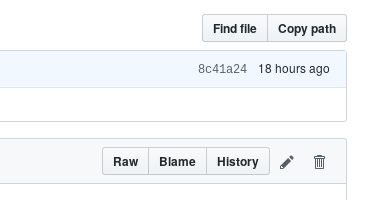

If you find typos or other errors (like broken links) in the material. Or if you feel like improving the material in some way:

* Click the GitHub link at the top of the course material pages. This will take you to the root of the repository.
* Find the section you want to fix/improve. This will most likely be an `md` file.
* When you browse to the document in question you will see a pencil symbol to the upper right of the document.
* Sign in to GitHub, click the pencil icon on the top right:

* Fix the error and propose a change (button at the bottom of the page):

* Create a pull request:

* Confirm the pull request:

* Your fix will be submitted for review and the course page will be updated once a course assistant accepts the change.
